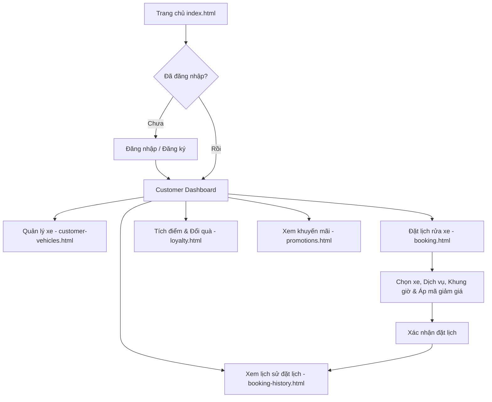
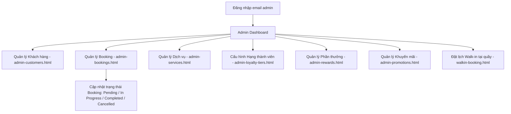
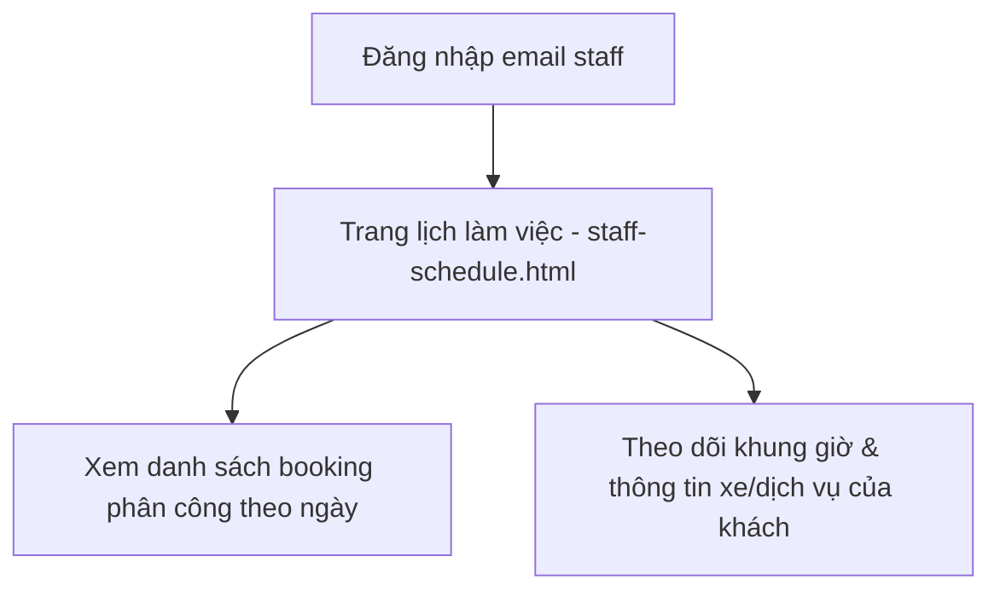

# AutoWash Pro - Frontend

Frontend cho **AutoWash Pro** - Hệ thống quản lý rửa xe tự động thông minh với đặt lịch trước, chương trình tích điểm (loyalty), đổi phần thưởng và quản lý khuyến mãi.

Toàn bộ giao diện là **static HTML/CSS/JS** (hỗ trợ cả Mock Data qua `localStorage` và API backend). Dữ liệu mẫu được nạp từ `assets/js/mock-data.js` và lưu trên `localStorage` của trình duyệt.

## Tech stack

- HTML5 / CSS3 / Vanilla JavaScript (không build, không bundler)
- Lưu trữ phía client bằng `localStorage` (prefix `autowash_`)
- Hỗ trợ Mock API / Real API qua `assets/js/mock-api.js` và `assets/js/api-config.js`
- Script Node.js tùy chọn (`build-pages.cjs`) để tái tạo các trang dashboard

## Cấu trúc thư mục

```
.
├── index.html                 # Landing page
├── login.html                 # Đăng nhập
├── register.html              # Đăng ký
├── forgot-password.html       # Quên mật khẩu
├── reset-password.html        # Đặt lại mật khẩu
│
├── customer-dashboard.html    # Dashboard khách hàng
├── customer-vehicles.html     # Quản lý xe
├── booking.html               # Đặt lịch rửa xe (online)
├── walkin-booking.html        # Đặt lịch trực tiếp tại cửa hàng (Walk-in)
├── booking-history.html       # Lịch sử đặt lịch
├── loyalty.html               # Chương trình tích điểm
├── promotions.html            # Khuyến mãi
│
├── admin-dashboard.html       # Dashboard quản trị
├── admin-customers.html       # Quản lý khách hàng
├── admin-bookings.html        # Quản lý booking
├── admin-services.html        # Quản lý dịch vụ
├── admin-loyalty-tiers.html   # Cấu hình hạng thành viên
├── admin-rewards.html         # Quản lý phần thưởng đổi điểm
├── admin-promotions.html      # Quản lý khuyến mãi
├── admin-analytics.html       # Báo cáo / phân tích
├── admin-staff.html           # Quản lý nhân viên
│
├── staff-schedule.html        # Lịch làm việc của nhân viên
│
├── MOCK_API.md                # Tài liệu Mock API
├── build-pages.cjs            # Script Node sinh lại các trang dashboard
│
└── assets/
    ├── css/
    │   ├── style.css          # Style chính (landing + auth + components)
    │   ├── dashboard.css      # Style cho layout dashboard (sidebar, navbar)
    │   └── responsive.css     # Media queries
    ├── js/
    │   ├── api-config.js      # Cấu hình API endpoint
    │   ├── mock-data.js       # MOCK_DATA + helpers (currency, badge, storage)
    │   ├── mock-api.js        # Giả lập REST API client
    │   ├── main.js            # Auth, sidebar, toast, filter, requireAuth
    │   ├── dashboard.js       # Renderer cho từng trang (data-page)
    │   ├── booking.js         # Logic form đặt lịch online
    │   ├── walkin-booking.js  # Logic đặt lịch tại cửa hàng (Walk-in)
    │   └── modal.js           # Mở/đóng modal
    └── images/
```

## Các vai trò người dùng

`assets/js/main.js` quyết định vai trò dựa trên email khi đăng nhập:

| Vai trò    | Cách đăng nhập (demo)   | Trang sau đăng nhập       |
| ---------- | ----------------------- | ------------------------- |
| Customer   | email bất kỳ            | `customer-dashboard.html` |
| Admin      | email chứa `admin`      | `admin-dashboard.html`    |
| Staff      | email chứa `staff`      | `staff-schedule.html`     |

Tài khoản demo gợi ý (mật khẩu bất kỳ):
`customer@mail.com`, `admin@mail.com`, `staff@mail.com`.

## Luồng người dùng theo vai trò (User Flows)

### 1. Luồng Khách hàng (Customer Flow)



### 2. Luồng Quản trị viên (Admin Flow)



### 3. Luồng Nhân viên (Staff Flow)



## Tính năng chính

- **Landing page** giới thiệu dịch vụ, gói rửa, hạng thành viên
- **Đăng ký / Đăng nhập / Quên mật khẩu / Reset mật khẩu**
- **Customer**
  - Dashboard: điểm tích lũy, tổng lượt rửa, tiến độ lên hạng, lịch hẹn sắp tới
  - Quản lý xe (thêm/sửa/xóa qua modal)
  - Đặt lịch online theo khung giờ + áp dụng khuyến mãi + tự tính giảm hạng / điểm
  - Đặt lịch trực tiếp tại cửa hàng (`walkin-booking.html`)
  - Lịch sử đặt lịch có lọc theo trạng thái/ngày
  - Loyalty: hiển thị hạng, lịch sử điểm, đổi phần thưởng
  - Khuyến mãi đang hoạt động
- **Admin**
  - Dashboard tổng quan, doanh thu, KH theo hạng
  - CRUD: khách hàng, booking, dịch vụ, hạng thành viên, phần thưởng đổi điểm (`admin-rewards.html`), khuyến mãi, nhân viên (`admin-staff.html`)
  - Báo cáo / phân tích (`admin-analytics.html`)
- **Staff**
  - Xem lịch rửa xe trong ngày

## Hạng thành viên (mock)

| Hạng     | Lượt rửa | Chi tiêu | Pt rate | Cửa sổ đặt | Giảm |
| -------- | -------- | -------- | ------- | ---------- | ---- |
| Member   | 0        | 0đ       | 1.0x    | 7 ngày     | 0%   |
| Silver   | 5        | 500K     | 1.2x    | 10 ngày    | 5%   |
| Gold     | 15       | 2M       | 1.5x    | 12 ngày    | 10%  |
| Platinum | 30       | 5M       | 2.0x    | 14 ngày    | 15%  |

## Cách chạy

Project là static site, chỉ cần mở file `index.html` bằng trình duyệt.

```powershell
start index.html
```

Để tránh lỗi CORS hoặc đường dẫn tương đối, nên phục vụ qua HTTP server:

```powershell
# Python 3
python -m http.server 8080

# hoặc Node.js
npx serve .
```

Sau đó truy cập http://localhost:8080.

## Tái tạo các trang dashboard

Đa số trang dashboard (`customer-*`, `admin-*`, `booking*`, `loyalty.html`, `promotions.html`, `staff-schedule.html`, `register.html`, `forgot-password.html`, `reset-password.html`, `walkin-booking.html`) được sinh bởi `build-pages.cjs`. Khi cần chỉnh layout/sidebar/navbar dùng chung, sửa script rồi chạy:

```powershell
node build-pages.cjs
```

Script sẽ ghi đè các file HTML tương ứng trong thư mục gốc.

## Reset dữ liệu

Mock data được nạp vào `localStorage` lần đầu (`autowash_initialized`). Để nạp lại từ đầu, mở DevTools console và chạy:

```js
localStorage.clear();
location.reload();
```
